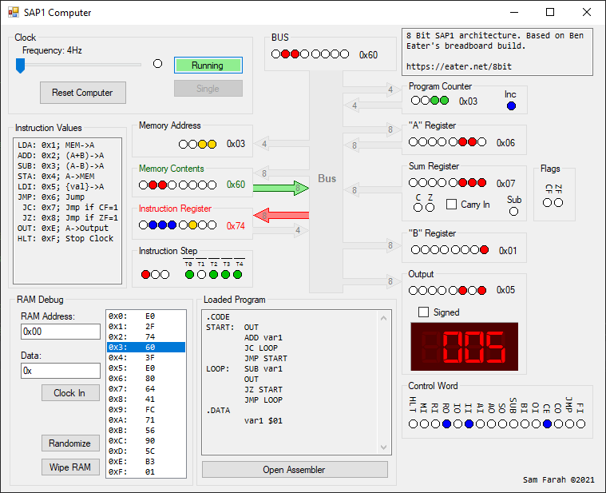

# SAP1-Emulator

Copyright 2021 Sam Farah

An emulator for "Simple As Possible 1" (SAP1) computer with visual representation of each internal device and what changes it encounters as the computer is running.
This design is modeled after [Ben Eater's breadboard build](https://www.youtube.com/watch?v=HyznrdDSSGM&list=PLowKtXNTBypGqImE405J2565dvjafglHU&ab_channel=BenEater).



## Description

A SAP1 computer contains the following:
* Accumulator  "A" Register: Stores 8bit of data directly, as well as the result of Sum/Subtraction
* General use "B" Register: General use register that can only be "loaded" into
* Output Register:  Connected to a 7-segment display that shows the value of the register in decimal
* Instruction Register (IR): Holds the current instruction being used
* Memory Address Register (MAR): Holds the current memory address being used
* Flags Register: Holds Zero Flag (ZF) and Carry Flag (CF) that were produced while doing Sum/Sub
* Program Counter: Increments once per "execution cycle" to tell the computer where is the next instruction
* Memory (RAM): 16bytes of RAM is connected to the MAR, stores machine code and data

Each of these "devices" has its own class. The simulation form "taps" into each of these modules to display its content on as LEDs and other visual representation. 

## Getting Started

### Dependencies

* .NET Framework v4.7
* For the display to look nice, you will need to install Digital-7 Mono font(by Sizenko Alexander). you can get it from Docs -> digital-7 (mono).ttf or from [Here](https://fonts2u.com/download/digital-7-mono.font)

### Executing the program

You can run the code using visual studio 2017+, no NuGet packages required for this to work, uses all "vanilla" libraries

for example to run a simple program that multiplies 3x5, all you need is the following:
```C#
byte foo()
{
  SAP1_8Bit Computer = new SAP1_8Bit(); //Create a computer instance
  Computer.RAM.MEM = new byte[] { 0x1e, 0x3c, 0x76, 0x1d, 0xe0, 0xf0, 0x4e, 0x1d,
                                  0x2f, 0x4d, 0x60, 0x00, 0x01, 0x00, 0x03, 0x05 }; //load a program (multiply 3*5)

  Computer.Reset(); //Reset the computer (not really required after creating a new object instance)
  Computer.Clock.Start();// start the computer clock
  while (!Computer.Clock.Halt) ; // wait for the program to finish executing
  return Computer.Output.Data; // use output
}
```

The above code block shows the bare minimum requirements to run the computer. However, in the "SimulationForm.cs" it expands on that by showing single changes on each component of the computer as the clock cycle progresses (either automatically or step-by-step)

## License

This project is licensed under the [MIT License](http://en.wikipedia.org/wiki/MIT_License) - see the LICENSE.md file for details

## Acknowledgments
* [Ben Eater](https://github.com/beneater); YouTube Channel: https://www.youtube.com/user/eaterbc, Website: https://eater.net/
* [George Jonsson](https://www.codeproject.com/Articles/1095576/Bit-Field-in-Csharp-using-struct)
